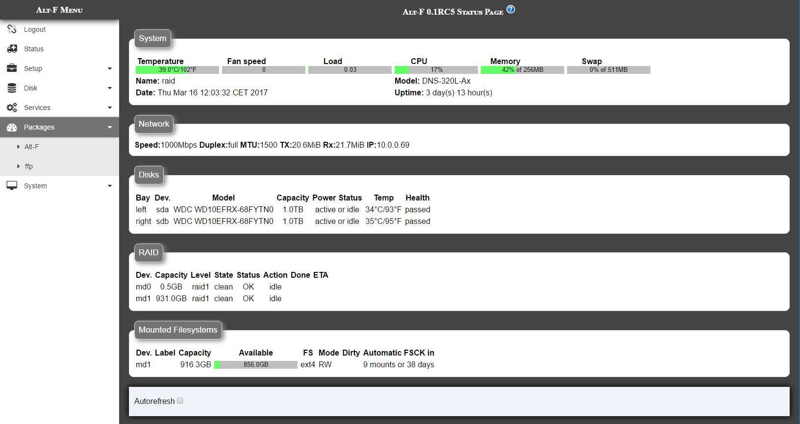

# altf_theme
Modern theme for Alt-F (alternative firmware for raid)

Installation 
-----------------------------
Connect via ssh / telnet to your nas and execute this command lines:

> cd /usr/www/scripts

> git clone https://github.com/strollo/altf_theme.git modern

> cp modern/modern.thm .

Switch to darkest theme?
-----------------------------
> git checkout dark

Open web admin page of nas and go to System->Utilities and switch theme from dull to modern

Screenshot
-----------------------------

The dark theme 

Enjoy
   ;)
   
